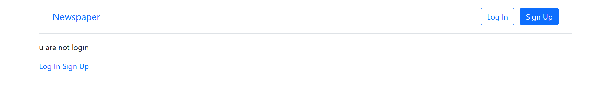
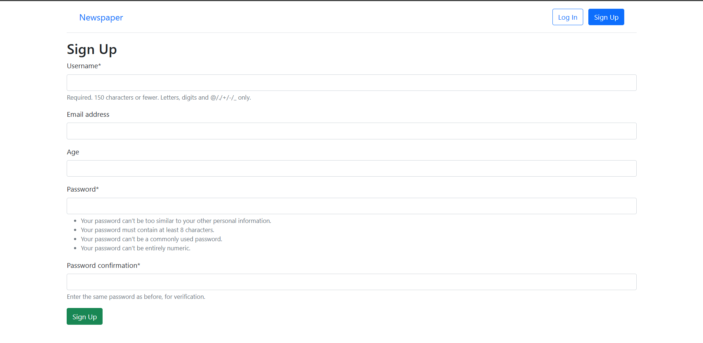

# Newspaper Website

A simple news publishing web application built using Django.  
The application allows users to create, edit, and delete articles, as well as read articles published by other users.

---

## Project Overview

This project is a basic implementation of a news website where authenticated users can manage articles. Each article has its own page displaying the full content and details about the author.

The main goal of the project is to practice Django fundamentals such as models, views, templates, authentication, and CRUD operations.

---

## Features

- User authentication (Signup, Login, Logout)
- Create new articles
- Edit existing articles
- Delete articles
- Article list page
- Article detail page
- Author-based permissions

---

## Technologies Used

- Python
- Django
- HTML
- CSS
- SQLite

---

## Project Structure

```
Newspaper/
│
├── articles/
├── users/
├── templates/
├── static/
├── db.sqlite3
├── manage.py
└── requirements.txt
```

---

## Installation

### 1. Clone the repository

```
git clone https://github.com/Mahmoud-Zaid9/Newspaper.git
```

### 2. Navigate to the project directory

```
cd Newspaper
```

### 3. Create a virtual environment

```
python -m venv venv
```

### 4. Activate the virtual environment

Windows:

```
venv\Scripts\activate
```

Mac / Linux:

```
source venv/bin/activate
```

### 5. Install dependencies

```
pip install -r requirements.txt
```

### 6. Apply database migrations

```
python manage.py migrate
```

### 7. Run the development server

```
python manage.py runserver
```

Then open the following address in your browser:

```
http://127.0.0.1:8000/
```

---

## Screenshots

### Home Page


### Articles Page


### Login Page


### Sign Up Page


---

## Author

Mahmoud Zaid  
GitHub: https://github.com/Mahmoud-Zaid9